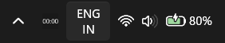
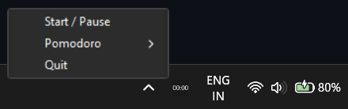
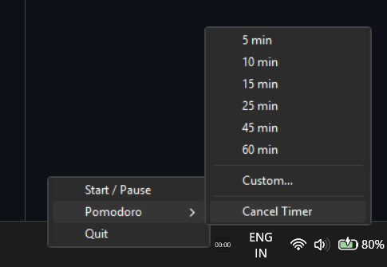

# ⏱️ Windows System Tray Stopwatch & Pomodoro Timer

A lightweight Windows system tray application that combines a stopwatch, a Pomodoro timer, and a global keyboard hotkey. It lives entirely in your taskbar tray, updates dynamically, and sends native Windows toast notifications.

---

## ✨ Features

- **⏱️ System Tray Stopwatch:** Monitor elapsed time directly on the taskbar. Start, pause, or resume with a single click.
- **🍅 Pomodoro Timer:** Start a Pomodoro timer with pre-configured intervals (5, 10, 15, 25, 45, 60 minutes) or enter a custom duration.
- **🔔 Native Toast Notifications:** Get notified with audio and visual popups when your Pomodoro timer completes.
- **⌨️ Global Hotkey:** Press `Win + Alt + S` from anywhere on Windows to toggle (start/pause) the timer instantly.
- **🎨 Visual Status Indicators:** 
  - Grey background: Running Stopwatch.
  - Orange background: Paused state (with pause symbol).
  - Red background: Running Pomodoro Timer.

---

## 📸 Screenshots

### ⏱️ Stopwatch in Taskbar Tray


> [!IMPORTANT]
> **Keep the timer visible:** By default, Windows may hide new tray icons under the `^` overflow menu. To keep the timer visible at all times:
> 1. Click the small arrow `^` in your taskbar tray.
> 2. Click and drag the stopwatch icon directly onto your main taskbar tray.
> 3. Now the timer is permanently visible and updates in real-time!

### 🖱️ Context Menu (Right-Click)
Right-click on the timer icon in the system tray to open the main menu. From here, you can start/pause the timer, access Pomodoro options, or exit the application.



### 🍅 Pomodoro Presets & Custom Timer
Choose from preset Pomodoro durations (5, 10, 15, 25, 45, 60 minutes) or click "Custom..." to set your own countdown timer.



---

## 🚀 How to Download & Run (For Users)

The easiest way to use this app is to download the pre-compiled executable:

1. Go to the **Releases** section on the right side of this GitHub repository page.
2. Download the latest version of `stopwatch_tray.exe`.
3. Double-click the downloaded file to run it. No installation or Python setup is required!
4. Find the stopwatch icon in your system tray (bottom-right corner next to the clock). If it's hidden, drag it out of the `^` overflow menu as shown in the screenshots section above.


---

## 🛠️ Running from Source (For Developers)

If you'd like to inspect, modify, or run the app from the Python source code:

### Prerequisites

Make sure you have Python 3.8+ installed on your Windows machine.

### Installation

1. Clone the repository:
   ```bash
   git clone https://github.com/YOUR_USERNAME/YOUR_REPO_NAME.git
   cd YOUR_REPO_NAME
   ```

2. Install the required dependencies:
   ```bash
   pip install pystray keyboard pillow
   ```

3. Run the application:
   ```bash
   python stopwatch_tray.py
   ```

---

## 📦 How to Compile the Executable

If you modify the source code and want to compile a new `.exe` file, you can use **PyInstaller**:

1. Install PyInstaller:
   ```bash
   pip install pyinstaller
   ```

2. Build the project using the provided `.spec` file:
   ```bash
   pyinstaller stopwatch_tray.spec
   ```
   *Note: This generates the executable in the `dist/` directory.*

---

## 📝 License

This project is open-source and available under the [MIT License](LICENSE).
